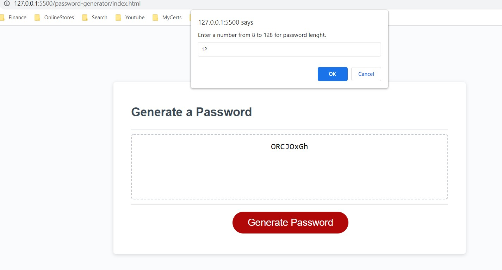
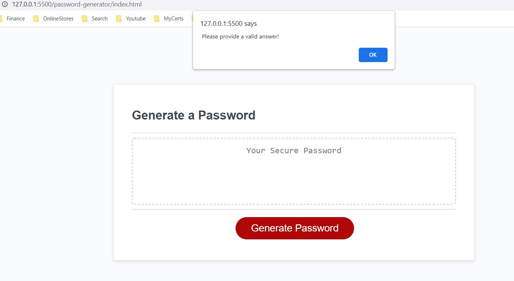
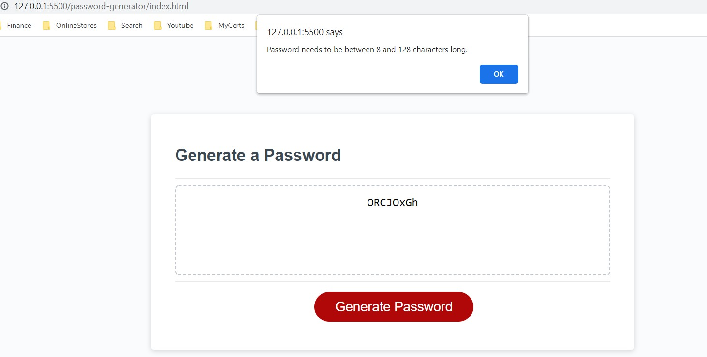
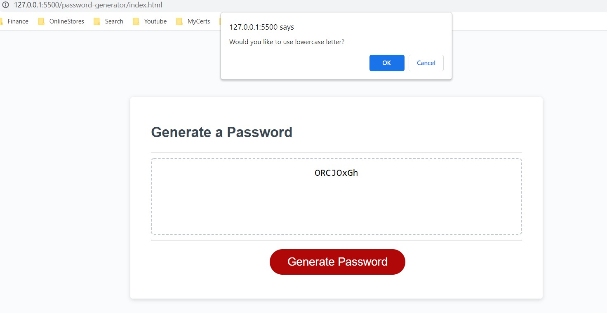
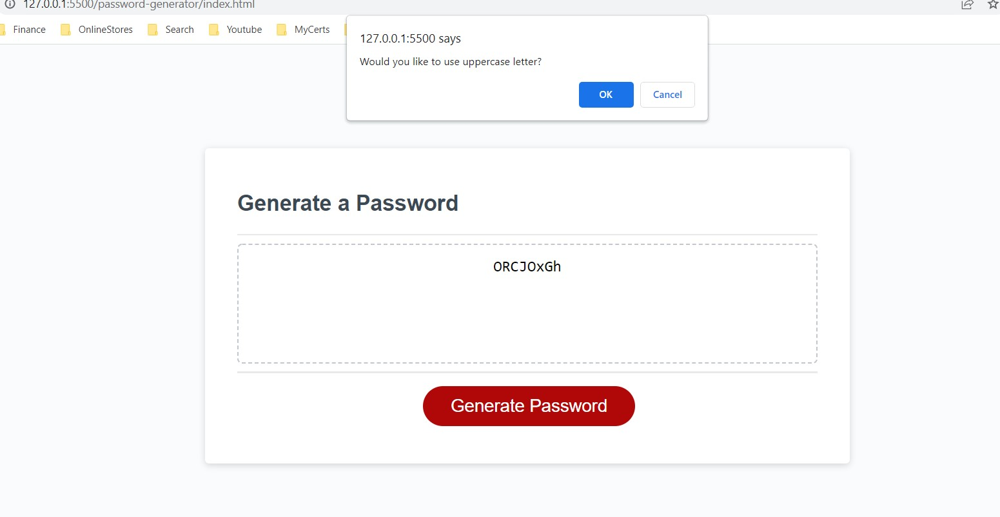
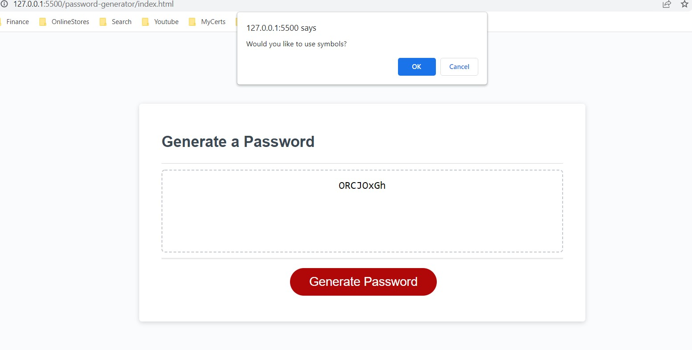
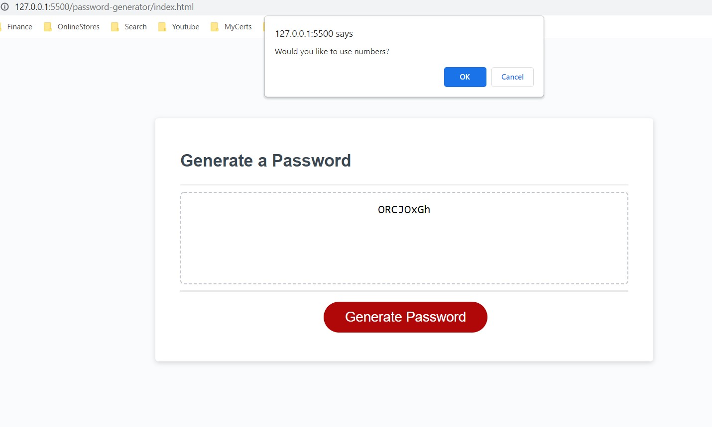
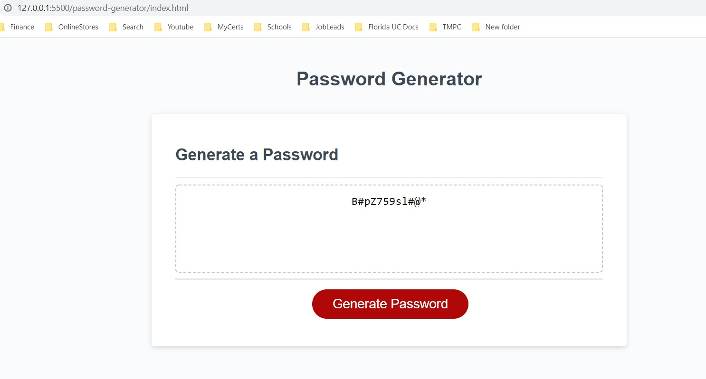

# Password Generator 

# Purpose

This appliction is to randomly generate a password for users to protect their sensitive data. 

- When user click the button to generate a password, window with prompt to enter the length of password between 8 to 128.

- It will prompt the user if they leave the input is blank.

- It will propmt the user if they input the number is less than 8 or greater than 128

- It prompt users to if they want to use lowercase letters.

- It prompt users to if they want to use uppercase letters.

- It prompt users to if they want to use symbols.

- It prompt users to if they want to use numbers.

- A password is generated that matched the selected criteria.

# Built with
* HTML
* CSS
* JavaScript

# Deployment

To deploy this project go to: https://moniquemeas.github.io/Password-Generator/

# Contribution

Monique Meas

